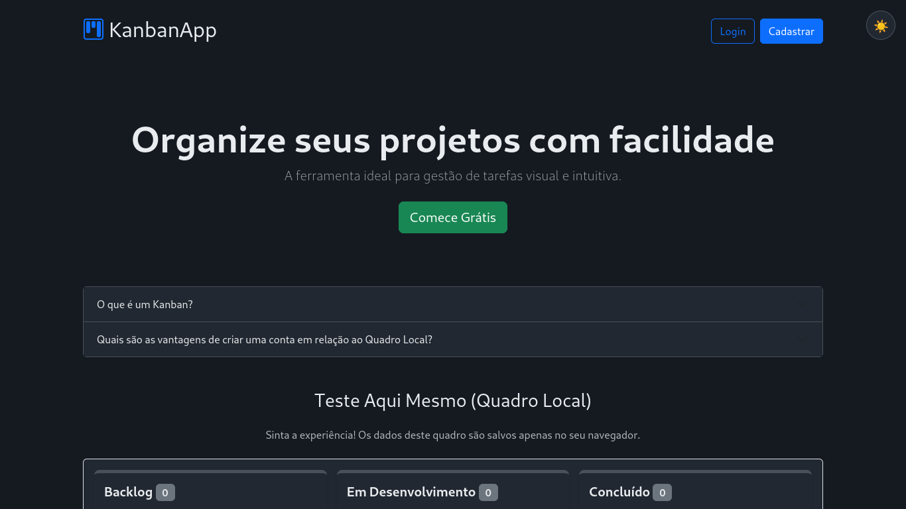
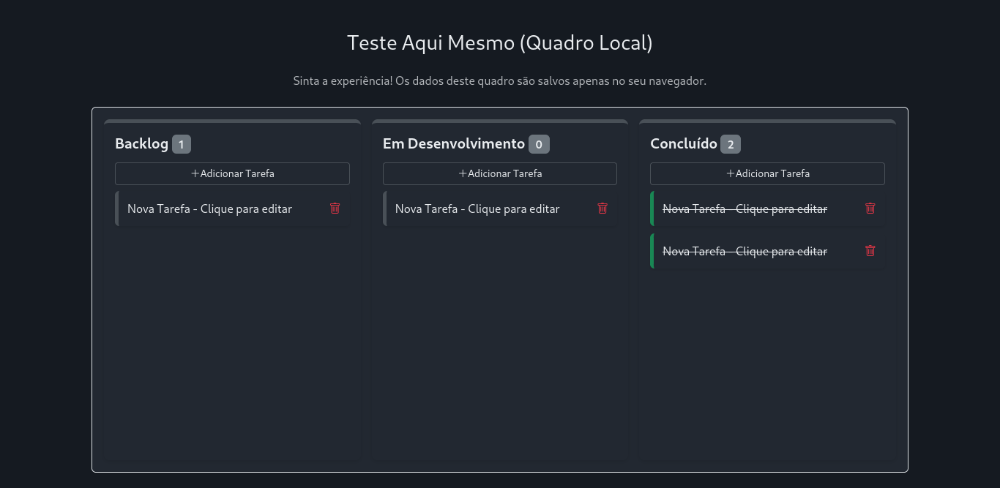
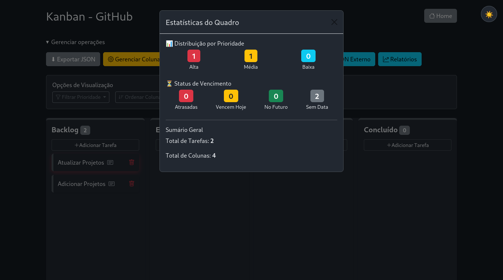
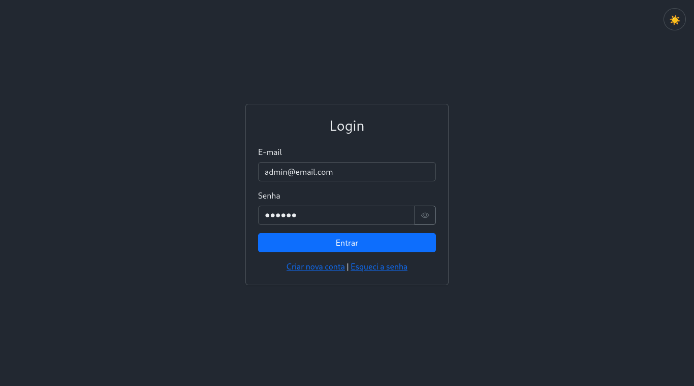
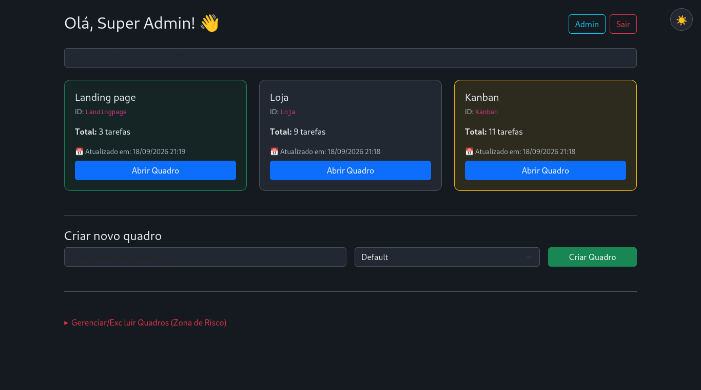
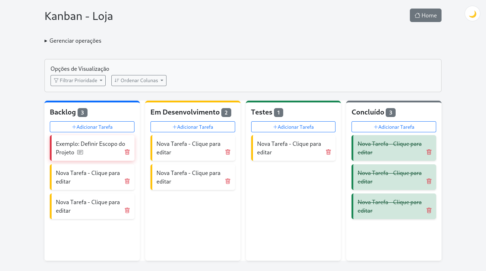
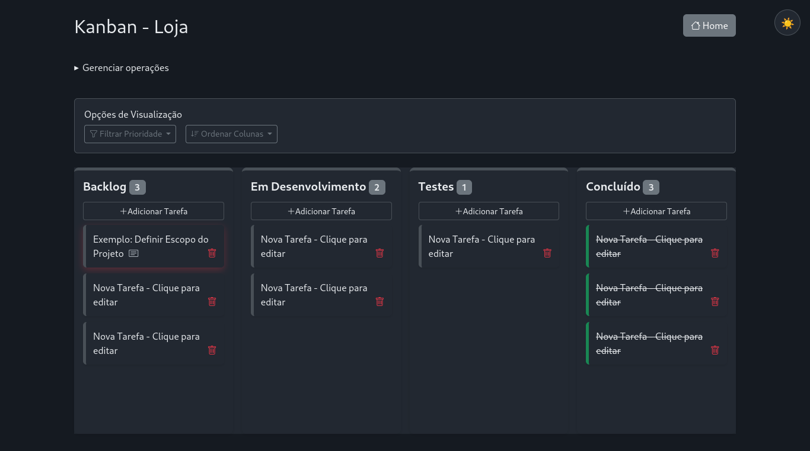
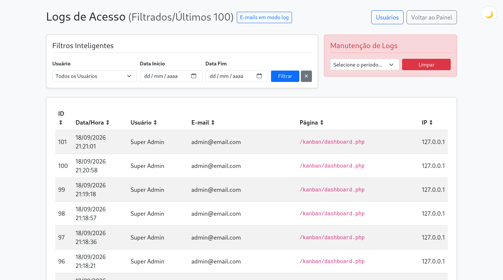

# KanbanApp

Aplicação web de gerenciamento visual de tarefas baseada no método Kanban. O projeto combina PHP, MySQL/MariaDB e módulos JavaScript para criar quadros, organizar cartões e acompanhar o fluxo de trabalho.

> **Versão atual:** 2.0.0  
> **Status:** em desenvolvimento, com a arquitetura principal migrada para persistência em banco de dados.

## Visão geral

O KanbanApp oferece dois modos de uso:

- **Demonstração pública:** disponível na página inicial, sem cadastro. O quadro de teste é salvo apenas no `localStorage` do navegador.
- **Área autenticada:** permite criar vários quadros, salvar dados no MySQL/MariaDB, acessar os quadros por diferentes dispositivos e utilizar recursos de administração.

A arquitetura atual usa `board.php?id=<identificador>` como entrada única para os quadros autenticados. Os antigos arquivos PHP e JSON gerados fisicamente foram preservados em `legacy/` apenas para histórico.

## Principais recursos

- Cadastro, confirmação de e-mail, login e recuperação de senha.
- Dashboard com os quadros pertencentes ao usuário autenticado.
- Criação de quadros a partir de templates JSON.
- Colunas e cartões configuráveis.
- Arrastar e soltar para movimentar tarefas.
- Prioridades, datas de vencimento, filtros e ordenação.
- Importação e exportação de quadros em JSON.
- Relatórios básicos de prioridade, vencimento, tarefas e colunas.
- Tema claro/escuro com preferência persistida.
- Controle de acesso por usuário e área administrativa.
- Logs de acesso e diagnóstico do ambiente.
- Controle de versão do quadro para reduzir conflitos de gravação.

## Requisitos

- PHP 8.x com as extensões PDO e PDO MySQL habilitadas.
- Apache com suporte a `.htaccess`.
- MySQL ou MariaDB.
- Composer.
- Navegador moderno com suporte a módulos JavaScript ES.
- SMTP funcional ou um driver de e-mail configurado para log/desenvolvimento.

O projeto foi organizado para uso local com XAMPP, mas pode ser adaptado para outros ambientes Apache/PHP.

## Instalação local com XAMPP

1. Clone ou copie o projeto para o diretório público do Apache:

   ```bash
   cd /opt/lampp/htdocs
   git clone <URL_DO_REPOSITORIO> kanban
   cd kanban
   ```

2. Instale as dependências PHP:

   ```bash
   composer install
   ```

3. Crie o banco de dados e importe o esquema:

   ```bash
   mysql -u root -p -e "CREATE DATABASE kanban CHARACTER SET utf8mb4 COLLATE utf8mb4_general_ci;"
   mysql -u root -p kanban < database/schema.sql
   ```

   As migrações incrementais estão em `database/migrations/` e devem ser aplicadas quando o banco já existir e precisar ser atualizado.

4. Crie a configuração local a partir do exemplo:

   ```bash
   cp .env.example .env
   ```

5. Ajuste `.env` para o seu ambiente. No XAMPP padrão, os valores mínimos normalmente são:

   ```dotenv
   APP_URL=http://localhost/kanban/
   DB_SERVER=127.0.0.1
   DB_USERNAME=root
   DB_PASSWORD=
   DB_NAME=kanban
   ```

   Nunca publique o `.env` nem coloque credenciais reais no repositório. O arquivo `.env.example` serve somente como referência.

6. Inicie Apache e MySQL no painel do XAMPP e abra:

   ```text
   http://localhost/kanban/
   ```

## Primeiro uso

### Testar sem criar conta

Na página inicial, use o quadro de demonstração. Ele permite testar a criação e movimentação de cartões, colunas, filtros, ordenação, relatórios e tema. Como os dados são locais, eles ficam restritos ao navegador e ao dispositivo usados no teste.

### Usar persistência no banco

1. Acesse **Cadastrar** e crie um usuário.
2. Confirme o endereço de e-mail usando o driver de e-mail configurado.
3. Faça login.
4. Crie um quadro no dashboard, escolhendo um identificador e um template.
5. Abra o quadro e teste a criação, edição e movimentação de cartões.
6. Recarregue a página para confirmar a persistência no banco.
7. Teste a exportação JSON antes de importar alterações em um quadro real.

Em desenvolvimento, o driver de log de e-mail pode ser usado para validar o fluxo sem enviar mensagens reais. Para SMTP, configure host, porta, usuário, senha e endereço de remetente no `.env`.

## Estrutura do projeto

| Diretório/arquivo | Finalidade |
|---|---|
| `index.php` | Página inicial e quadro público de demonstração |
| `dashboard.php` | Lista de quadros do usuário autenticado |
| `board.php` | Renderização de um quadro persistido no banco |
| `auth/` | Cadastro, login, confirmação e recuperação de senha |
| `admin/` | Usuários, logs, diagnósticos e funções administrativas |
| `core/` | Persistência, autenticação, segurança e módulos do Kanban |
| `database/` | Esquema e migrações SQL |
| `templates/` | Modelos iniciais de quadros |
| `assets/` | CSS, JavaScript de tema e imagens |
| `tests/` | Testes PHP existentes |
| `docs/` | Documentação técnica, operação, arquitetura e planos |
| `legacy/` | Artefatos históricos, sem função na arquitetura atual |
| `scripts/build.sh` | Geração do pacote de distribuição |

## Testes e verificações

Testes individuais podem ser executados diretamente com PHP:

```bash
php tests/board_validator_test.php
php tests/database_config_test.php
php tests/env_test.php
php tests/log_manager_test.php
php tests/mail_config_test.php
php tests/requested_features_test.php
php tests/security_test.php
```

Para verificar referências estáticas do projeto:

```bash
bash tools/audit_references.sh
```

Antes de uma publicação, também valide manualmente o fluxo de cadastro, confirmação de e-mail, criação de quadro, edição de tarefas, importação/exportação, exclusão e acesso administrativo.

## Gerar pacote de distribuição

O script de build cria um ZIP em `dist/` e exclui segredos, dependências vendorizadas, logs, testes, documentação, legado e artefatos locais:

```bash
./scripts/build.sh
```

Caso o checkout não preserve permissões de execução, use:

```bash
bash scripts/build.sh
```

O arquivo `.env.example` permanece disponível para orientar a configuração, mas arquivos `.env*` não entram no pacote de produção.

## Estado atual do projeto

### Concluído na versão 2.0.0

- Migração da fonte principal de dados para MySQL/MariaDB.
- Adoção de quadros dinâmicos acessados por identificador.
- Separação dos artefatos antigos no diretório `legacy/`.
- Dashboard com quadros vinculados ao usuário autenticado.
- Templates, importação/exportação JSON e relatórios básicos.
- Tema claro/escuro e melhorias de interface.
- Configuração por variáveis de ambiente.
- Proteções de autenticação, sessão, CSRF e escape de saída implementadas no código atual.
- Script de distribuição e regras de exclusão para publicação pública.

### Em validação ou evolução

- Validação completa em ambiente de produção ou staging.
- Testes de navegador nos fluxos principais.
- Configuração e operação de SMTP real.
- Política de retenção e armazenamento externo para logs.
- Backup, restauração e procedimento formal de rollback.
- Revisão contínua de segurança, desempenho e acessibilidade.

A documentação detalhada está em [`docs/DOCUMENTACAO-TECNICA.md`](docs/DOCUMENTACAO-TECNICA.md), [`docs/OPERACAO.md`](docs/OPERACAO.md), [`docs/ARQUITETURA-DESIGN.md`](docs/ARQUITETURA-DESIGN.md) e [`CHANGELOG-v2.0.0.md`](CHANGELOG-v2.0.0.md).

## Sugestões de screenshots para apresentação

### Página inicial


### Quadro Kanban


### Modal de relatórios


### Acesso


### Dashboard autenticado


### Gerenciamento de colunas


### Tema escuro


### Administração



## Licença

Este projeto está licenciado sob a Licença MIT - veja o arquivo [LICENSE](LICENSE) para mais detalhes.
