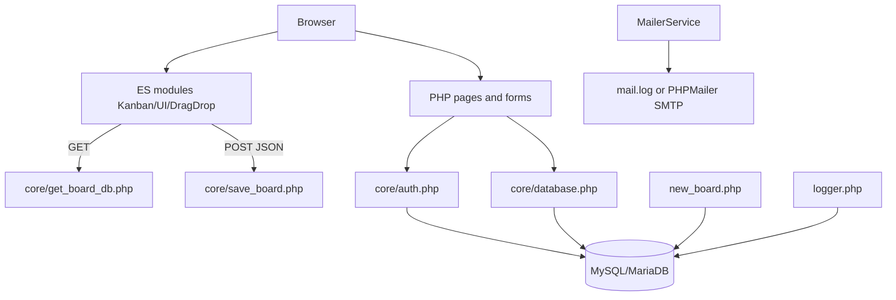
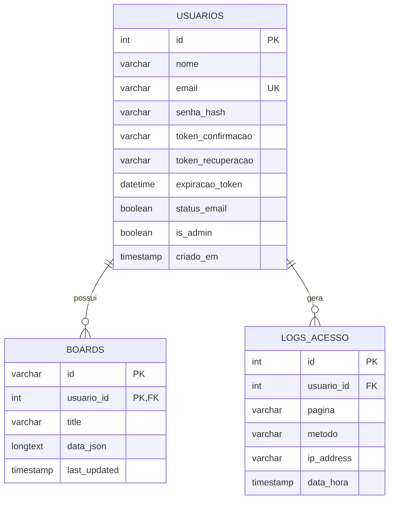

# Documentação Técnica e Auditoria — KanbanApp

**Versão analisada:** `kanban-v2.0.0`  
**Branch de documentação:** `documentacao-auditoria`  
**Autor:** MLSFront  
**Data da análise:** 15 de agosto de 2026  
**Escopo:** inspeção estática do ZIP fornecido, incluindo PHP, JavaScript, SQL, configuração Apache, Composer e arquivos de conteúdo.

> Esta documentação descreve somente comportamentos evidenciados pelo código analisado. Pontos não confirmáveis sem ambiente executável, banco populado, navegador ou requisitos de negócio estão marcados como **Assumir/Investigar**.

## 1. Resumo executivo

O projeto é uma aplicação web PHP para gerenciamento de quadros Kanban. A interface é renderizada por páginas PHP e módulos JavaScript ES, enquanto os dados autenticados são persistidos em MySQL/MariaDB como um documento JSON por quadro. Existe também um modo de demonstração público, persistido apenas no `localStorage`. A aplicação inclui cadastro, confirmação de e-mail, login, recuperação de senha, administração de usuários, listagem de quadros e logs de acesso.[1][2][3]

A estrutura é pequena e compreensível, mas apresenta riscos relevantes antes de uma implantação em hospedagem compartilhada. Os pontos mais urgentes são a ausência de proteção CSRF em operações mutáveis, a renderização de dados controlados pelo usuário via `innerHTML`, o uso de credenciais de banco hardcoded, a exposição de dados de debug/e-mail em arquivos e a existência de uma inconsistência entre a migração para MySQL e o script legado `migrate_to_mysql.php`.[4][5][6]

### 1.1 Dez principais achados

| Prioridade | Achado | Impacto | Evidência principal |
|---|---|---:|---|
| P0 | Ausência de CSRF em cadastro, criação, exclusão, promoção administrativa e limpeza de logs | Alto | Formulários POST sem token em `new_board.php`, `delete_boards.php`, `admin/users.php` e `admin/logs.php` [7][8][9] |
| P0 | XSS/HTML injection potencial em títulos e textos renderizados com `innerHTML` | Alto | `core/ui.js:188` e `core/ui.js:245` [10] |
| P0 | Credenciais do banco definidas no código-fonte | Alto | `core/database.php:5-8` [11] |
| P0 | Confiança excessiva no `HTTP_HOST` para montar `BASE_URL` | Alto | `core/config.php:8-21` [12] |
| P1 | Script de migração usa API MySQLi em uma conexão PDO e não fornece `usuario_id` | Alto | `core/migrate_to_mysql.php:5,21-22` e `database/schema.sql` [13][14] |
| P1 | Páginas de quadros geradas fisicamente e acessíveis apenas pelo ID, com regra especial para admin | Alto | `new_board.php`, `legacy/pages/*.php`, `core/get_board_db.php:27-32` [15][16] |
| P1 | Salvamento automático sem controle de concorrência, retry ou confirmação de versão | Médio/alto | `core/kanban.js:78-139` e `core/save_board.php:30-70` [17] |
| P1 | Logs síncronos no banco em cada página, sem retenção automática equivalente | Médio | `core/logger.php:10-38` e `admin/logs.php:153-168` [18] |
| P1 | Arquivos de log e backup ficam dentro do diretório da aplicação | Médio/alto | `core/logManager.php:8-18`, `core/debug.log`, `mail.log` [19] |
| P2 | Ausência de suíte de testes, lockfile e pipeline de validação | Médio | Apenas `composer.json`; não há `composer.lock`, testes ou CI no inventário [20] |

### 1.2 Dez melhorias rápidas

| Ordem | Melhoria | Esforço estimado | Benefício |
|---:|---|---:|---|
| 1 | Remover valores padrão de senha do formulário de login | Baixo | Evita exposição operacional imediata [21] |
| 2 | Mover banco, URL e e-mail para variáveis de ambiente fora do webroot | Baixo | Reduz vazamento de segredos [11][22] |
| 3 | Substituir `innerHTML` por `textContent` e criação segura de elementos | Baixo | Mitiga XSS no conteúdo de quadros [10] |
| 4 | Adicionar CSRF token a todos os POST e validar método explicitamente | Baixo | Protege ações autenticadas [7][8][9] |
| 5 | Corrigir `migrate_to_mysql.php` para PDO e associar cada quadro a um usuário | Baixo/médio | Torna migração executável [13] |
| 6 | Remover ou proteger `mail.log`, `debug.log` e `debug_log.txt` | Baixo | Reduz exposição de tokens e dados pessoais [19] |
| 7 | Fixar `APP_URL`/`BASE_URL` por ambiente | Baixo | Evita host header poisoning [12][22] |
| 8 | Adicionar índices em `logs_acesso(usuario_id, data_hora)` e `boards(usuario_id,last_updated)` | Baixo | Melhora filtros e dashboard [14][18] |
| 9 | Validar esquema do JSON importado antes de substituir o modelo em memória | Baixo | Evita estados inválidos e perda de dados [23] |
| 10 | Adicionar `composer.lock`, testes mínimos e script de lint | Baixo | Reprodutibilidade e regressão controlada [20] |

### 1.3 Cinco riscos críticos

| Risco | Cenário | Consequência | Mitigação inicial |
|---|---|---|---|
| R1 — comprometimento de conta | CSRF ou XSS executa ação em sessão autenticada | Alteração/exclusão de quadros ou promoção administrativa | CSRF, escaping rigoroso, CSP e reautenticação para ações sensíveis |
| R2 — vazamento de credenciais | Código ou backup do projeto é publicado | Acesso direto ao banco | Segredos fora do repositório, usuário DB sem privilégios excessivos e rotação |
| R3 — perda de dados | Dois dispositivos salvam o mesmo quadro ou importação inválida substitui o estado | Última gravação sobrescreve alterações | Controle de versão, ETag/updated_at, validação e histórico de versões |
| R4 — migração interrompida | Script legado é executado contra o esquema atual | Falha fatal ou dados sem dono | Reescrever migração como comando transacional e criar backup antes |
| R5 — exposição de dados sensíveis | `mail.log` ou logs são baixados/consultados | Tokens, nomes, e-mails e conteúdo podem ser expostos | Armazenar logs fora do webroot, permissões restritivas e retenção definida |

## 2. Visão geral do produto/projeto — PSD

### 2.1 Objetivo

O objetivo evidenciado é oferecer um quadro Kanban visual para criação e organização de tarefas, com colunas configuráveis, cartões com prioridade, descrição e vencimento, filtros, ordenação, relatórios simples, importação/exportação JSON e persistência de quadros por usuário.

### 2.2 Escopo funcional observado

| Área | Comportamento observado |
|---|---|
| Acesso público | Landing page e quadro de demonstração local no navegador, sem persistência no banco [2] |
| Identidade | Cadastro com confirmação de e-mail, login, logout, recuperação e redefinição de senha [24] |
| Quadros | Criação por template, listagem no dashboard, exclusão em lote e abertura por página gerada [7][8] |
| Kanban | Criação/edição/exclusão de tarefas, drag-and-drop de cartões e colunas, prioridades e vencimentos [10][17] |
| Persistência | JSON completo em `boards.data`, carregado por endpoint PHP e salvo por POST debounced [14][16][17] |
| Administração | Usuários, promoção a admin, quadros de usuários e logs de acesso [9][25] |
| E-mail | Driver local de log ou PHPMailer SMTP configurável [26] |

### 2.3 Requisitos funcionais derivados do código

| ID | Requisito |
|---|---|
| RF-01 | O sistema deve permitir o cadastro de usuário com nome, e-mail e senha. |
| RF-02 | O sistema deve exigir confirmação de e-mail antes do login. |
| RF-03 | O usuário autenticado deve visualizar somente seus próprios quadros no dashboard. |
| RF-04 | O usuário deve criar um quadro a partir de um template JSON existente ou de um fallback padrão. |
| RF-05 | O usuário deve editar o título, as colunas e as tarefas de um quadro. |
| RF-06 | O sistema deve persistir o documento JSON do quadro no banco. |
| RF-07 | O usuário deve exportar e importar o JSON do quadro. |
| RF-08 | O usuário deve excluir um ou mais quadros por POST. |
| RF-09 | O administrador deve consultar usuários, quadros e logs, além de promover usuários. |
| RF-10 | O administrador deve remover logs por período ou integralmente. |

### 2.4 Requisitos não funcionais e lacunas

Foram evidenciados PHP 8.x/MySQL/MariaDB como ambiente pretendido no conteúdo fornecido, PDO com `utf8mb4`, Bootstrap via CDN e Apache com `.htaccess`. Não foram evidenciados SLA, metas de latência, disponibilidade, backup, observabilidade centralizada, política de senha, política de retenção ou estratégia de recuperação de desastre. Esses pontos devem ser definidos como **Assumir/Investigar** antes da produção.

## 3. FSD — especificação funcional

### 3.1 Caso de uso: autenticar usuário

**Pré-condição:** o usuário possui cadastro confirmado. O usuário envia e-mail e senha por POST; o sistema consulta `usuarios`, valida o hash com `password_verify`, verifica `status_email`, regenera o ID da sessão e redireciona ao dashboard.[24]

**Caminhos alternativos:** campos vazios exibem erro; credenciais inválidas exibem mensagem genérica; conta sem confirmação é recusada. Não há limitação de tentativas, MFA, bloqueio progressivo ou registro explícito de falhas de login confirmado pelo código analisado.

### 3.2 Caso de uso: criar quadro

**Pré-condição:** sessão autenticada. O formulário envia `board_id` e `template`; ambos são reduzidos a caracteres alfanuméricos, sublinhado e hífen. O sistema verifica duplicidade por `(id, usuario_id)`, lê o template e insere o documento JSON no MySQL. A renderização usa a entrada dinâmica `board.php?id=<id>`; páginas PHP e JSONs físicos históricos ficam arquivados em `legacy/`.[7]

**Regra de negócio observada:** o mesmo slug pode existir para usuários diferentes porque a chave primária é composta por `id` e `usuario_id`.[14] A entrada dinâmica `board.php` e o endpoint de leitura aplicam a verificação de ownership; os arquivos PHP históricos em `legacy/pages/` não participam do fluxo ativo.[15][16]

### 3.3 Caso de uso: carregar e salvar quadro

Ao abrir a página, o JavaScript consulta `core/get_board_db.php?id=...`. Para usuário comum, a consulta exige `id` e `usuario_id`; para administrador, exige somente `id`. O retorno é o JSON persistido. Alterações no modelo chamam `Kanban.save()`, que agenda uma gravação após três segundos de inatividade e envia o JSON inteiro para `core/save_board.php`.[16][17]

O endpoint valida somente se o corpo é JSON e se `board_id` existe. O ID é sanitizado; o documento é serializado e atualizado ou inserido conforme a existência do par `(id, usuario_id)`. Não há limite de tamanho do corpo, validação profunda do esquema, controle de versão ou tratamento de concorrência.[17]

### 3.4 Caso de uso: importar/exportar

A exportação cria um Blob local. A importação analisa o arquivo e aceita qualquer objeto que possua `columns` e `tasks`, substituindo o modelo em memória antes do salvamento. A validação não confirma tipos, IDs únicos, correspondência entre colunas e chaves de tarefas, limites de tamanho ou campos permitidos.[23]

### 3.5 Caso de uso: administração

As páginas administrativas consultam `is_admin` para autorizar o acesso. Usuários podem ser promovidos via POST; quadros são listados por usuário; logs podem ser filtrados e excluídos por período. Essas mutações não apresentam token CSRF, confirmação server-side de intenção além do valor do campo e, no caso de limpeza total, executam `TRUNCATE TABLE`.[9][25]

### 3.6 Contratos HTTP observados

| Endpoint | Método | Entrada | Saída/efeito |
|---|---|---|---|
| `auth/login.php` | POST | `email`, `senha` | Sessão e redirect ao dashboard |
| `auth/register.php` | POST | `nome`, `email`, `senha`, `senha_confirm` | Registro e envio/log de confirmação |
| `auth/confirm.php` | GET | `token` | Ativa conta e redirect |
| `auth/forgot_password.php` | POST | `email` | Gera token de recuperação, quando usuário existe |
| `auth/reset_password.php` | GET/POST | `token`, `senha`, `senha_confirm` | Atualiza hash e invalida token |
| `core/get_board_db.php` | GET | `id` | JSON do quadro ou erro HTTP |
| `core/save_board.php` | POST JSON | `board_id`, `data` | JSON `{success,message}` |
| `new_board.php` | POST | `board_id`, `template` | Insere quadro no MySQL e redireciona ao dashboard |
| `delete_boards.php` | POST | `board_ids[]` | Exclui registros autorizados no MySQL, redirect |

## 4. Arquitetura e design

### 4.1 Arquitetura lógica

### 4.2 Camadas

| Camada | Componentes | Responsabilidade |
|---|---|---|
| Apresentação server-side | `index.php`, `dashboard.php`, `auth/*`, `admin/*`, `board.php` | HTML, formulários, redirects e gates de sessão |
| Apresentação client-side | `core/kanban.js`, `ui.js`, `dragdrop.js`, `columnManager.js`, `reportManager.js` | Modelo em memória, renderização e interação |
| Aplicação | `new_board.php`, `delete_boards.php`, `core/save_board.php`, `get_board_db.php` | Casos de uso e autorização por usuário |
| Infraestrutura | `database.php`, `logger.php`, `logManager.php`, `mailer.php` | Banco, logs e e-mail |
| Dados | `database/schema.sql`, migrations, coluna JSON em `boards.data` | Esquema relacional e documento do quadro; artefatos antigos em `legacy/` |

### 4.3 Modelo de dados

O quadro é armazenado como documento JSON, com `title`, `columns` e `tasks`. Essa decisão simplifica o salvamento integral, mas limita consultas, validações e atualizações parciais. O dashboard extrai `$.columns` e `$.tasks` usando funções JSON do MySQL/MariaDB, o que requer validação de compatibilidade com a versão real do servidor.[3]

### 4.4 Autenticação e autorização

A autenticação é baseada em sessão PHP e hash de senha. Há regeneração do ID de sessão após login. A autorização de leitura do documento é feita por usuário, com exceção para administradores. A autorização administrativa é repetida nas páginas por consulta de `is_admin`, em vez de ser encapsulada em middleware reutilizável. Não há evidência de CSRF, política de sessão segura, expiração por inatividade, MFA, RBAC além de `is_admin` ou trilha de auditoria de ações administrativas.[9][24]

### 4.5 Cache, observabilidade e erros

O endpoint de leitura declara `Cache-Control: private, max-age=300`, mas o front-end também acrescenta cache-busting em `Board.reload()`. O salvamento não define `Cache-Control: no-store` nem retorna versão do documento. Exceções de banco são parcialmente registradas em arquivos ou `error_log`; algumas páginas exibem a mensagem de exceção diretamente ao usuário, o que não é adequado para produção.[16][17][25]

## 5. Guia operacional

### 5.1 Ambiente local XAMPP

O procedimento pretendido é copiar o diretório do projeto para o document root do Apache, normalmente `htdocs/kanban`, criar um banco chamado `kanban`, executar `database/schema.sql`, aplicar as migrations em ordem e configurar PHP 8.x com extensões PDO MySQL, JSON, OpenSSL e, se SMTP for usado, as dependências do Composer. O código atual assume `localhost`, usuário `root`, senha vazia e banco `kanban`.[11]

Essa configuração é aceitável apenas como hipótese de desenvolvimento local. Para staging e produção, deve ser substituída por configuração externa. O `BASE_URL` atual assume `/kanban/` quando o host é `localhost` e raiz quando não é, portanto instalações locais em outro diretório exigem alteração de código ou comportamento inesperado.[12]

### 5.2 Dependências

| Dependência | Evidência | Observação |
|---|---|---|
| PHP 8.x | Requisito do ambiente informado | Versão exata não registrada no projeto |
| MySQL/MariaDB | DSN e schema | Versão e modo SQL não fixados |
| Apache/mod_rewrite | `.htaccess` | Deve estar habilitado para as regras funcionarem |
| PHPMailer | `composer.json` | `phpmailer/phpmailer:^7.1`; não há `composer.lock` [20] |
| Bootstrap/Bootstrap Icons | CDN nas páginas | Dependência externa de disponibilidade e integridade |

### 5.3 Build e deploy

Não há script de build, pipeline, configuração de staging/prod, health check, mecanismo de migrations versionadas no banco, backup automatizado ou instrução de rollback. O deploy atual parece ser cópia de arquivos e aplicação manual de SQL. Antes de produção, recomenda-se separar configuração por ambiente, retirar arquivos graváveis do webroot, criar rotina de backup e registrar a versão do schema.

### 5.4 Operação e manutenção

Os logs de acesso são armazenados em banco e podem ser limpos pela tela administrativa. O `LogManager` mantém arquivo de debug com rotação de 1 MB e retenção de 30 dias, mas cria o diretório de arquivo dentro de `core`. O driver de e-mail `log` grava o HTML completo em `mail.log`; isso deve ser explicitamente desabilitado ou protegido em produção.[18][19][26]

## 6. Qualidade, riscos e manutenção

### 6.1 Verificações realizadas

| Verificação | Resultado |
|---|---|
| Inventário de arquivos | 26 PHP, 9 JavaScript, 4 JSON, 3 SQL, CSS e configuração Apache |
| Histórico Git | Apenas commit inicial `bc324a0`; branch criada: `documentacao-auditoria` |
| PHP lint | Não executado porque o binário `php` não está disponível neste sandbox |
| Composer validate | Não executado porque o binário `composer` não está disponível |
| Testes automatizados | Não localizados |
| Execução funcional | Não realizada; não há banco/servidor XAMPP ativo neste ambiente |

### 6.2 Tech debt radar

O maior vetor de dívida técnica é a coexistência de duas estratégias de persistência: arquivos JSON/páginas geradas e banco MySQL. O front-end ainda contém caminhos para JSON externo, enquanto `.htaccess` bloqueia `.json`; o script de migração usa MySQLi, mas o restante usa PDO; e o schema atual exige `usuario_id`, que não é fornecido pela migração legada.[13][14][27]

Também há duplicação de autenticação administrativa, funções auxiliares repetidas para sanitização e remoção de diretórios, HTML gerado por heredoc, configuração espalhada entre `core/database.php`, `core/config.php` e `src/Config/*`, e ausência de contratos formais para o documento JSON.

## 7. Bugs, gargalos, segurança e melhorias

### 7.1 Achado A-01 — XSS em conteúdo do quadro

**Severidade:** P0. **Sintoma:** um título de tarefa ou coluna pode ser interpretado como HTML/JavaScript ao ser renderizado. **Causa provável:** uso de `innerHTML` com `title`, `task.text`, `col.title`, `col.color` e datas provenientes do documento do quadro.[10]

**Local e evidência:** `core/ui.js:188` usa `h.innerHTML = \`${title} ...\``; `core/ui.js:245` usa `title.innerHTML = task.text + iconsHTML`; `core/columnManager.js:32-38` monta HTML com dados da coluna. O conteúdo pode ser introduzido por importação JSON ou edição no próprio quadro.

**Reprodução conceitual:** importar um JSON com `task.text` contendo uma tag HTML ou atributo malformado e abrir o quadro. A confirmação prática exige navegador. **Correção:** usar `textContent` para conteúdo textual, construir ícones como nós DOM, validar cor como hexadecimal e aplicar Content Security Policy sem `unsafe-inline` após refatorar handlers.

### 7.2 Achado A-02 — CSRF em operações mutáveis

**Severidade:** P0. **Sintoma:** uma página externa pode induzir um navegador autenticado a enviar POST para criar/excluir quadro, promover usuário ou limpar logs. **Causa:** formulários não exibem token anti-CSRF e os endpoints não validam um token por sessão.[7][8][9]

**Correção:** gerar token aleatório por sessão, incluir campo hidden em todos os POST, validar com comparação constante, exigir `SameSite=Lax/Strict`, verificar `Origin`/`Referer` como defesa complementar e solicitar reautenticação para promoção e limpeza total.

### 7.3 Achado A-03 — Segredos e configuração hardcoded

**Severidade:** P0. **Sintoma:** o projeto depende de `root` sem senha no banco e contém placeholders SMTP no código. **Evidência:** `core/database.php:5-8` e `src/Config/Mail.php`.[11][22]

**Correção:** ler `DB_*`, `APP_URL`, driver e SMTP de variáveis de ambiente ou arquivo fora do webroot, falhar sem revelar detalhes, usar usuário DB dedicado e remover segredos do histórico Git.

### 7.4 Achado A-04 — Host header poisoning em BASE_URL

**Severidade:** P0/P1. **Sintoma:** links e tokens de confirmação/recuperação podem ser gerados com host controlado pelo cabeçalho HTTP. **Evidência:** `core/config.php:8-21` usa `$_SERVER['HTTP_HOST']` diretamente; o link de confirmação usa `BASE_URL`.[12][24]

**Correção:** definir `APP_URL` explicitamente por ambiente, validar host permitido e configurar proxy confiável quando houver reverse proxy.

### 7.5 Achado A-05 — Migração quebrada e incompatível com o schema

**Severidade:** P1. **Sintoma:** `core/migrate_to_mysql.php` abre uma conexão PDO por `get_db_connection()` e em seguida chama `bind_param()` e `close()`, métodos de MySQLi. Além disso, insere em `boards` sem `usuario_id`, coluna `NOT NULL` no schema atual.[13][14]

**Correção:** reescrever integralmente com PDO e parâmetro `usuario_id`; exigir usuário destino, validar JSON, usar transação, registrar falhas e fazer backup antes da migração. O script não deve permanecer exposto como endpoint web.

### 7.6 Achado A-06 — Inconsistência entre página gerada, arquivos JSON e autorização

**Severidade:** P1. **Sintoma:** o projeto mantém `pages/{id}.php` e `boards/{id}/{id}.json`, mas o carregamento normal usa o banco. O `Board.reload()` tenta buscar JSON externo, enquanto `.htaccess` bloqueia `.json`.[15][27]

**Causa:** migração incompleta da persistência em arquivo para banco. **Correção:** escolher MySQL como fonte única, remover `jsonPath/source` e `ENABLE_BOARD_FILE_BACKUP` quando não necessários, ou documentar uma estratégia de backup não publicável.

### 7.7 Achado A-07 — Corrida e perda de atualização no autosave

**Severidade:** P1. **Sintoma:** dois dispositivos podem salvar o documento inteiro e a última requisição sobrescreve a outra; requisições lentas podem retornar fora de ordem. **Evidência:** `Kanban.saveToServer()` envia todo o objeto sem versão, e `save_board.php` executa UPDATE sem condição de `last_updated`.[17]

**Correção:** adicionar `version` ou `last_updated` esperado ao payload, atualizar com condição otimista, retornar conflito HTTP 409, cancelar requisições anteriores quando necessário e manter fila/retry com backoff.

### 7.8 Achado A-08 — Log síncrono e crescimento de dados

**Severidade:** P1. **Sintoma:** cada página que inclui `logger.php` abre conexão e faz INSERT síncrono em `logs_acesso`; a tabela não possui índice explícito para os filtros principais.[18]

**Correção:** indexar `usuario_id` e `data_hora`, limitar payload de URI/IP, aplicar retenção por job/cron, separar eventos de auditoria de telemetria e considerar escrita assíncrona quando o volume crescer.

### 7.9 Achado A-09 — Logs sensíveis no webroot

**Severidade:** P1. **Sintoma:** e-mails completos, tokens e mensagens de debug podem ser gravados em arquivos da aplicação.[19][26]

**Correção:** mover logs para diretório fora do document root, restringir permissões, excluir `mail.log` de artefatos de deploy, redigir tokens e dados pessoais e definir retenção.

### 7.10 Achado A-10 — Controle administrativo e validação insuficientes

**Severidade:** P1. **Sintoma:** o painel promove usuários e limpa logs com POST sem CSRF; páginas exibem exceções diretamente em alguns casos; não há reautenticação ou confirmação server-side para ações de alto impacto.[9][25]

**Correção:** centralizar `requireAdmin()`, CSRF, auditoria de ação, confirmação transacional e mensagens genéricas. A exclusão de logs deve registrar quem executou, quando, escopo e quantidade removida.

### 7.11 Outros bugs prováveis

| Local | Problema provável | Impacto |
|---|---|---:|
| `core/ui.js:130-135` | Ao salvar detalhes de uma tarefa, o texto da tarefa também é passado a `Kanban.updateTitle`, alterando o título do quadro sem intenção | Médio |
| `core/ui.js:6` | ID baseado apenas em `Date.now()` pode colidir em criações muito rápidas ou múltiplas abas | Baixo/médio |
| `core/kanban.js:183-198` | `moveTask` assume que arrays de origem e destino existem; JSON inconsistente pode causar erro | Médio |
| `core/boardManager.js:49-55` | `reload()` não trata HTTP error nem JSON inválido antes de gravar no `localStorage` | Médio |
| `dashboard.php:66-75` | “Todas as tarefas na última coluna” depende da última posição de `columns`; coluna finalizadora não é uma regra explícita | Baixo/médio |
| `admin/logs.php:337-345` | `nome` e `email` aparecem sem `htmlspecialchars`, embora venham do banco; XSS persistente seria possível se dados fossem comprometidos | Médio |
| `new_board.php:57-59` | Diretórios são criados com `0777`, excessivo para hospedagem compartilhada | Médio |

### 7.12 UI/UX e acessibilidade

A interface usa Bootstrap e é responsiva em nível básico, com `viewport`, grids e elementos flexíveis. Porém, existem controles representados por `
` clicável, ícones sem alternativas claras, handlers inline, confirmação via `confirm()` e mensagens de erro inconsistentes. A exclusão de coluna remove todas as tarefas, embora o comportamento destrutivo esteja apenas em um alerta; recomenda-se oferecer arquivamento ou confirmação com contagem e possibilidade de cancelamento.

O quadro possui filtros e relatórios, mas não há evidência de suporte completo a teclado para drag-and-drop, anúncio de mudanças para leitores de tela, foco gerenciado nos modais ou mensagens ARIA de salvamento. A criação de HTML com dados do usuário também prejudica a segurança e a previsibilidade visual.

## 8. Backlog priorizado

### P0 — bloquear antes de produção

| ID | Tarefa | Critério de aceite |
|---|---|---|
| P0-01 | Implementar CSRF global | Todos os POST mutáveis rejeitam token ausente/inválido com 403 |
| P0-02 | Eliminar HTML inseguro no front-end | Conteúdo de tarefa/coluna é exibido como texto e testes de payload XSS passam |
| P0-03 | Externalizar segredos e URL | Nenhuma senha, host de produção ou token fica no código versionado |
| P0-04 | Corrigir geração de URL | Links usam URL configurada e host não confiável é rejeitado |
| P0-05 | Proteger logs e arquivos | Logs ficam fora do webroot e não contêm tokens ou HTML integral |

### P1 — corrigir antes de escala

| ID | Tarefa | Critério de aceite |
|---|---|---|
| P1-01 | Reescrever migração como PDO transacional | Migração de fixture executa em schema atual e atribui `usuario_id` |
| P1-02 | Escolher MySQL como fonte única | Não há fluxo de leitura operacional por JSON público |
| P1-03 | Implementar controle otimista de concorrência | Conflito retorna 409 sem sobrescrever alteração remota |
| P1-04 | Centralizar autorização | `requireAuth`/`requireAdmin` são reutilizados em todos os endpoints |
| P1-05 | Validar esquema do quadro | JSON inválido é rejeitado com mensagem e estado anterior preservado |
| P1-06 | Adicionar índices e retenção | Consultas de dashboard/logs usam índices e job de retenção documentado |
| P1-07 | Corrigir escaping em todas as views | Saídas vindas de banco/entrada usam escaping por contexto |

### P2 — qualidade e evolução

| ID | Tarefa | Critério de aceite |
|---|---|---|
| P2-01 | Criar testes unitários e de integração | Cobertura dos casos de login, ownership, save, import e admin |
| P2-02 | Adicionar Composer lock e lint no CI | Instalação reproduzível e pipeline bloqueia sintaxe inválida |
| P2-03 | Melhorar acessibilidade | Navegação por teclado, foco, labels e ARIA testados |
| P2-04 | Substituir páginas PHP geradas | Rota única com `board_id` validado reduz arquivos mutáveis |
| P2-05 | Criar histórico/backup de quadros | Usuário pode recuperar versões sem depender de arquivos expostos |

## 9. Assumir/Investigar

| Pergunta objetiva | Motivo |
|---|---|
| Um slug de quadro deve ser único globalmente ou apenas por usuário? | O schema permite reutilização por usuário, mas páginas físicas usam somente o slug. |
| Administradores devem visualizar qualquer quadro? | O endpoint permite isso; a regra precisa ser formalizada e auditada. |
| A exclusão de coluna deve apagar tarefas definitivamente? | O código faz isso; a UX deveria confirmar ou oferecer arquivamento. |
| O JSON é contrato público ou apenas formato interno? | Isso define versionamento, validação e compatibilidade. |
| Qual versão mínima de MySQL/MariaDB é suportada? | O dashboard usa funções JSON e `CHECK (json_valid(...))`. |
| Qual política de senha e retenção de logs é obrigatória? | Não há regra documentada no projeto. |
| O envio real de e-mail será SMTP ou serviço externo? | O código possui driver `log` como padrão e placeholders SMTP. |

## 10. Procedimento Git para alterações futuras

A branch `documentacao-auditoria` foi criada a partir do commit inicial existente. Recomenda-se manter documentação e código em commits separados, com mensagens descritivas e revisão antes do merge. Um fluxo sugerido é: criar branch por mudança, alterar uma seção, executar lint/testes disponíveis, revisar diff, commitar com escopo claro e registrar o impacto no backlog.

Exemplos de mensagens: `docs: adicionar PSD do KanbanApp`; `docs: documentar contratos do save_board`; `security: adicionar proteção CSRF`; `fix: corrigir migração PDO para boards`; `test: cobrir ownership de quadros`.

## Referências internas

[1]: ../../inventory.txt "Inventário, histórico Git e manifestos"
[2]: ../index.php "Landing page e modo de demonstração"
[3]: ../dashboard.php "Dashboard e métricas derivadas do JSON"
[4]: ../core/ui.js "Renderização da interface do quadro"
[5]: ../core/database.php "Conexão PDO e configuração do banco"
[6]: ../core/migrate_to_mysql.php "Migração legada para MySQL"
[7]: ../new_board.php "Criação de quadros"
[8]: ../delete_boards.php "Exclusão de quadros"
[9]: ../admin/users.php "Administração de usuários"
[10]: ../core/ui.js "Renderização e edição de tarefas/colunas"
[11]: ../core/database.php "Constantes de conexão"
[12]: ../core/config.php "Construção de BASE_URL"
[13]: ../core/migrate_to_mysql.php "Script incompatível com PDO/schema atual"
[14]: ../database/schema.sql "Schema relacional"
[15]: ../legacy/pages/AmoreSalvao.php "Página de quadro gerada arquivada"
[16]: ../core/get_board_db.php "Leitura autorizada do quadro"
[17]: ../core/kanban.js "Autosave e atualização do modelo"
[18]: ../core/logger.php "Log síncrono de acesso"
[19]: ../core/logManager.php "Rotação de logs em arquivo"
[20]: ../composer.json "Dependência PHPMailer e autoload"
[21]: ../auth/login.php "Valores padrão expostos no formulário"
[22]: ../src/Config/Mail.php "Configuração do mailer"
[23]: ../core/boardManager.js "Importação e exportação JSON"
[24]: ../auth/register.php "Cadastro e confirmação"
[25]: ../admin/logs.php "Filtros e limpeza de logs"
[26]: ../core/mailer.php "Drivers de e-mail"
[27]: ../.htaccess "Bloqueios Apache de arquivos e diretórios"

## 11. Plano de ação e governança de correções

O plano executável, com roadmap de 30 dias úteis, responsáveis por papel, branches, critérios de aceite, matriz de testes, métricas de sucesso, gates de staging/produção e checklist semanal, está em [`PLANO-DE-ACAO.md`](./PLANO-DE-ACAO.md). A ordem recomendada é corrigir primeiro CSRF, XSS, segredos, geração de URL e exposição de logs; em seguida estabilizar migração, ownership, contrato JSON e concorrência; por fim consolidar operação, testes, acessibilidade e release.

A documentação deve ser atualizada junto com cada alteração de comportamento. Decisões sobre unicidade de slug, privilégios administrativos, exclusão de colunas, versão mínima do banco, política de senha, retenção de logs, RTO/RPO e metas de latência permanecem como pontos de decisão do kickoff.

## 10. Estado da implementação e liberação

A execução do plano de ação está registrada em [`IMPLEMENTACAO-STATUS.md`](./IMPLEMENTACAO-STATUS.md). Foram implementadas frentes separadas para segurança P0, integridade/persistência e gates operacionais. Os testes locais de CSRF, contrato JSON, logs, lint PHP e sintaxe JavaScript foram aprovados.

A aplicação permanece em estado **No-Go para produção** até que a migration de versão seja aplicada em cópia restaurada do banco, o staging valide autenticação, ownership, SMTP, Apache, importação inválida e conflito concorrente, e os responsáveis técnico, de produto e segurança aprovem os critérios de aceite. A validação de Composer, banco populado, navegador, Apache e SMTP ainda não foi substituída por testes locais.

## 11. Melhorias solicitadas — implementação recente

A branch `feature/requested-improvements`, commit `02f21c4`, implementa a primeira rodada das melhorias solicitadas: conclusão visual e limpeza de vencimentos, transliteração de IDs de quadros, persistência do JSON físico inicial, ownership no documento, tema global claro/escuro, e-mail configurável e logging em `logs/`.

O aceite funcional exige validação no XAMPP com os nomes `Controle Produção` e `Amor e Salvação`, confirmação de que os quadros são persistidos no MySQL sem criação de arquivos físicos ativos, movimentação de uma tarefa para a coluna concluída, alternância de tema em telas públicas e autenticadas, teste de `MAIL_DRIVER=log`/`off`/`smtp` e isolamento de dois usuários.
